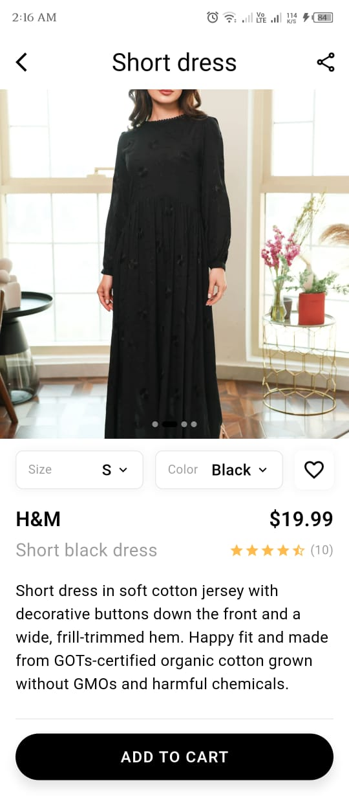
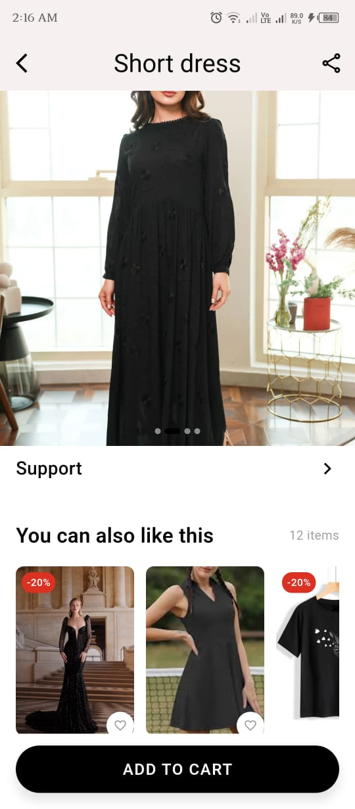
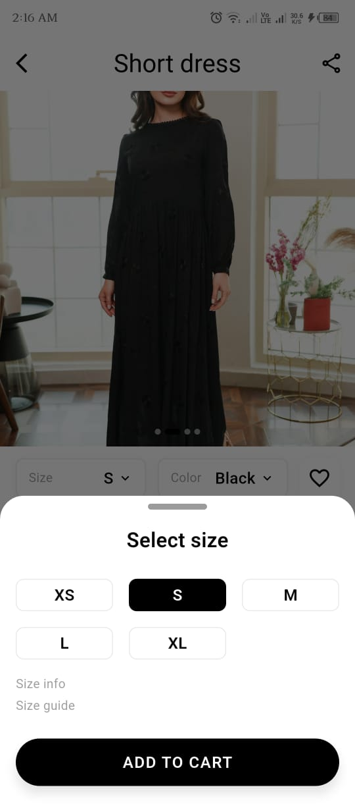
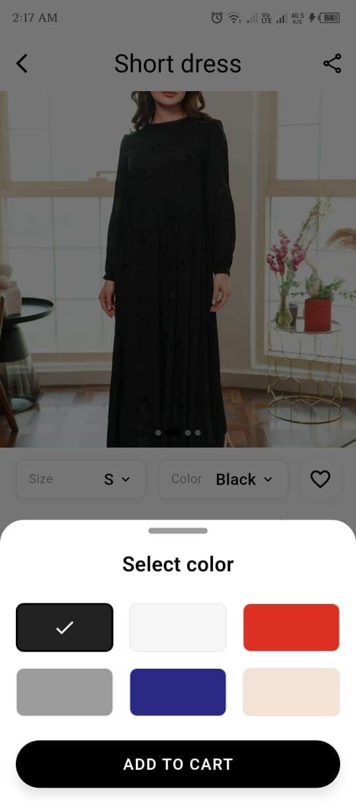
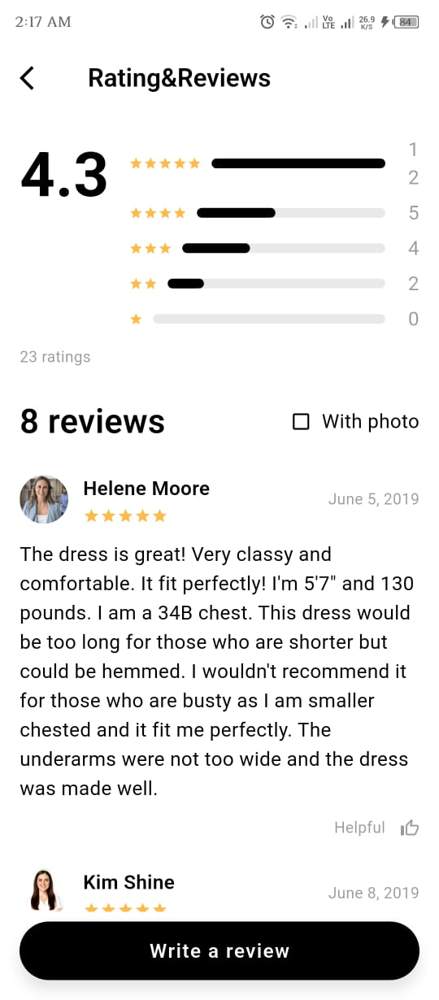

# Goofy Street 

## App Overview
### Purpose of the App
The purpose of this app is to create a user-friendly eCommerce platform for clothing where users can browse, search, and purchase apparel seamlessly. The app aims to offer a smooth shopping experience with features such as product browsing, adding to cart or favorites, managing user profiles, and secure checkout.

## App Vision
A simple and elegant clothing store app built using Flutter.

## Objectives
1. Implement core eCommerce functionalities.
2. Practice clean navigation and UI structure.
3. Integrate Firebase authentication and state management.

## App Screenshots

       

## Navigation Flow
There are mainly two types of users. Initially we will focus on the user/Learner part. For future scope we might add Admin part.
### 👩‍🛍 Learner (User) Journey
1. Opens app → see Splash Screen.
2. Proceeds to Login/Signup page.
3. Logs in → redirected to Home Page with product carousel and product cards. 
4. Navigates to Shop Tab → searches categories → adds product to Favourites.
5. Goes to Bag Tab → reviews selected items → proceeds to Checkout.
6. Fills Shipping Address → selects Payment Method → sees Success Page.
### 🧑‍💻 Admin (Optional) Journey
1. Logs into the admin dashboard.
2. Adds new product details with image and category.
3. Reviews user orders and manages stock inventory.

